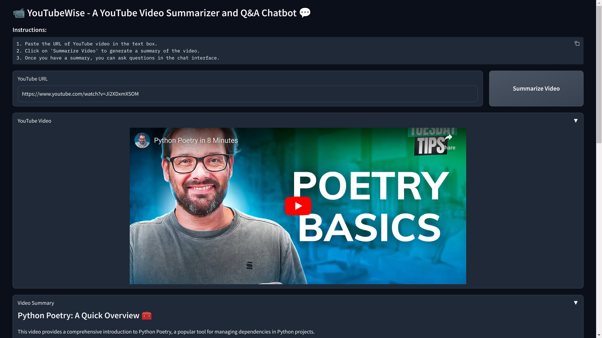
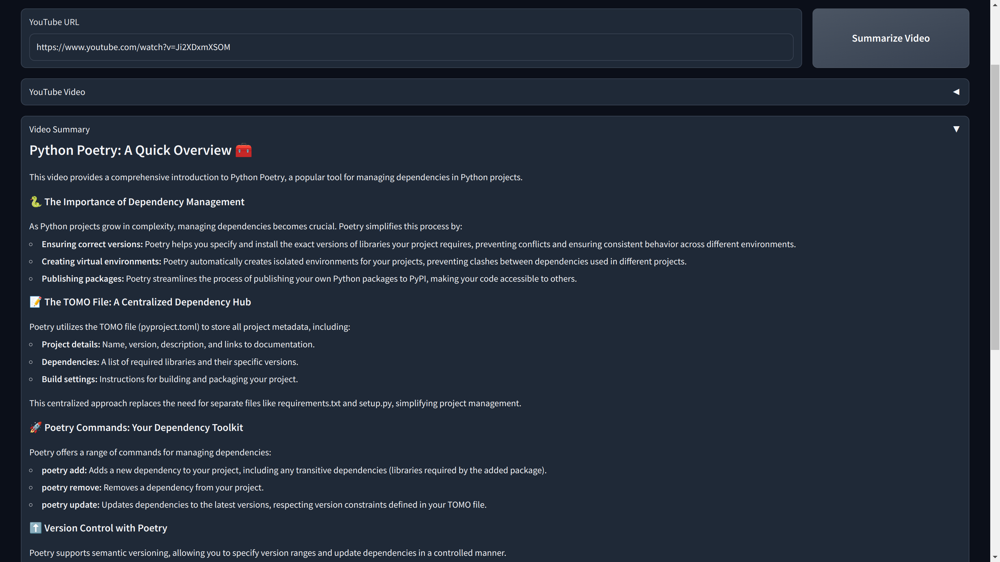
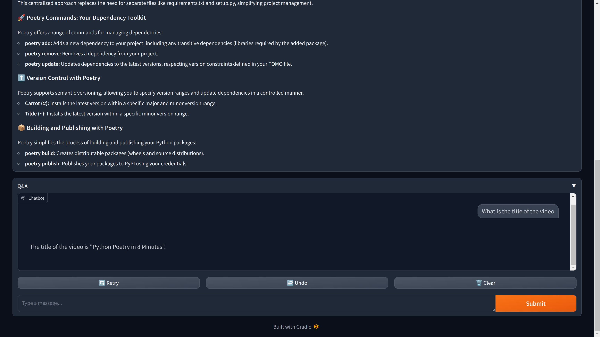

# **YouTubeWise**

---
YouTubeWise is an AI-powered YouTube video summarizer that enables users to quickly understand the main points of videos. It uses Large Language Models (LLMs) to analyze and summarize YouTube content, making it easier for viewers to quickly grasp the main points of videos with concise summaries and Q&amp;A functionality.

## **Features**

* **Summarization**: Get a concise summary of YouTube videos in just a few seconds.

* **Q&A**: Ask questions about the video and receive accurate answers generated by LLMs.
* **Openai API Support**:
    
    * Run on local servers, such as:
    	+ LM Studio
    	+ Ollama
    * Use online services that support OpenAI's API, including:
    	+ openrouter
    	+ Other compatible platforms

**Getting Started**
-------------------

### Clone the Repository

```
git clone https://github.com/Viraj-08/YouTubeWise.git
```

### Install Poetry (if you haven't already)

```
pip install poetry
```

### Set Up Your Project Directory

```
Navigate to your project directory.
Create a virtual environment using the `pyproject.toml` file:
poetry init
poetry install
```

### Configure Virtual Environment Options (Optional)

```
poetry config virtualenvs.in-project true
```

This will create the virtual environment in a `.venv` directory within your project.

**Running YouTubeWise**
----------------------

Once you have set up your virtual environment, you can run the application by executing the following commands in your project directory:

```
poetry shell
python gradio_launcher.py
```

This will start the web server and make the application available at `http://localhost:7860` in your browser.
 Note: The port may change, so please check the actual port number when starting the server.

### Screenshots



